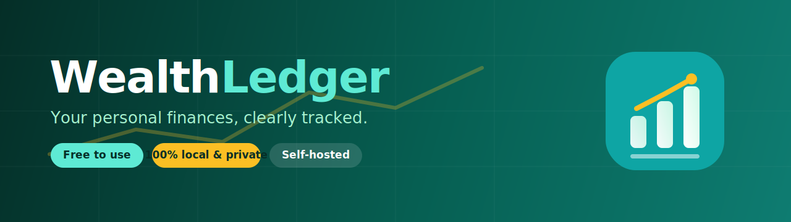
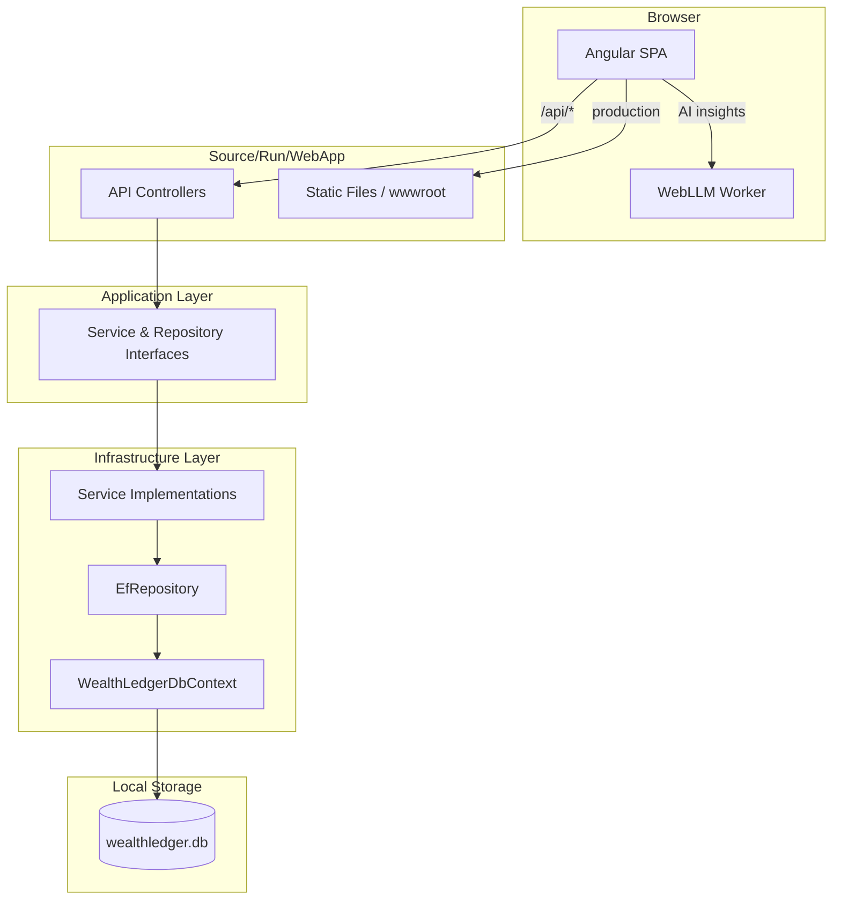
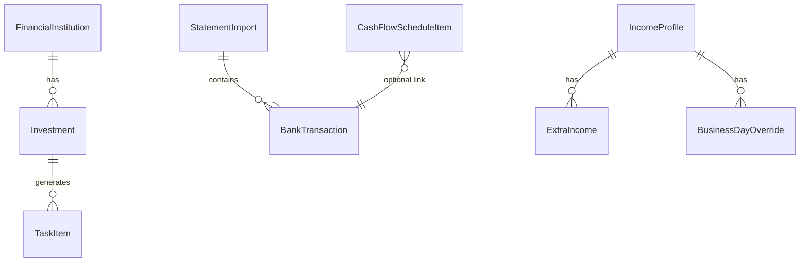

<div align="center">



<h1></h1>

**Your personal finances, clearly tracked.**

A free, self-hosted personal finance app for tracking investments, institutions, cash flow, and bank statements — with live market data and optional, fully browser-local AI insights. Your data never leaves your machine.

[](LICENSE)
[](#-license--usage)
[](https://dotnet.microsoft.com/)
[](https://angular.dev/)
[](#-privacy)

[🌐 Visit the Website](https://lcarlini.github.io/WealthLedger/) · [Features](#-features) · [Quick Start](#-quick-start) · [Installation](#-installation) · [Backup & Restore](#-backup--restore) · [Documentation](#-documentation)

</div>

---

## ✨ Overview

**WealthLedger** is a full-stack, single-user personal finance dashboard you run on your own computer. It combines a modern Angular interface with an ASP.NET Core API and a local SQLite database — so all of your financial information stays private and offline by default.

<table>
<tr>
<td width="33%" valign="top">

### 📊 Track
Investments, financial institutions, and net worth across multiple currencies (BRL, USD, EUR).

</td>
<td width="33%" valign="top">

### 📈 Plan
Multi-month cash flow simulations, income planning, and financial calculators.

</td>
<td width="33%" valign="top">

### 🔒 Own
100% local SQLite storage. Optional AI insights run in your browser — nothing is sent to the cloud.

</td>
</tr>
</table>

---

## 🔐 Privacy

WealthLedger is designed to be **private by default**:

- Your data lives in a local **SQLite** file on your machine — never in a hosted service.
- **AI insights** (optional) run entirely in your browser via [WebLLM](https://webllm.mlc.ai/) + WebGPU. No Ollama, no cloud LLM, no API keys.
- The only outbound calls are to **public** market-data endpoints (FX rates and economic indices) for read-only quotes.
- This repository ships with **synthetic sample data only** — no real credentials, connection strings, or personal statements are included.

---

## 🚀 Features

| Area | Highlights |
|------|-----------|
| **Dashboard** | Total net worth, live market widgets (USD, EUR, BTC, Selic, IPCA…), investment & patrimony charts, 12-month gains |
| **Institutions** | Full CRUD with pagination, search, CSV import/export |
| **Investments** | Multi-currency accounts, CDI-linked or fixed rates, maturity tracking, CSV import/export |
| **My Tasks** | Auto-generated tasks from investment rules (maturities, monthly movements) with a pending-count badge |
| **Control (Cash Flow)** | Multi-month simulation matrix, manual income/expense/debt items, card installment planning |
| **Import OFX** | Upload bank & credit-card statements (OFX 2.x), auto-categorization, transaction browsing |
| **Analytics** | Spending by category, below-inflation warnings, optimization hints, and **browser-local AI insights** |
| **Calculator** | Yield, gain/loss, loan (Price table), emergency-fund planner, savings vs. fixed-rate comparisons |

---

## 🧱 Tech Stack

| Layer | Technology |
|-------|------------|
| Frontend | Angular 20 · TypeScript 5.9 · Angular Material · Chart.js / ng2-charts |
| Backend | .NET 10 · ASP.NET Core Web API |
| Data | Entity Framework Core 10 · SQLite |
| Mapping | AutoMapper |
| API docs (dev) | OpenAPI + Scalar |
| External data | Public FX & economic-index APIs (read-only) |
| AI (optional) | WebLLM + WebGPU, fully in-browser |

---

## 🏗️ Architecture

Clean architecture with four .NET layers plus a standalone Angular frontend.



| Layer | Path | Role |
|-------|------|------|
| **SPA** | `Source/Run/SPA/` | UI, routing, HTTP services, charts, local AI insights |
| **WebApp** | `Source/Run/WebApp/` | HTTP host, controllers, CORS, static file serving, SPA fallback |
| **Application** | `Source/Application/Application/` | Business contracts (interfaces) |
| **Infrastructure** | `Source/Infrastructure/Infrastructure/` | EF Core, SQLite, service implementations, DI |
| **Contracts** | `Source/_Core/Contracts/` | Domain models, enums, API request/response types |

---

## 📋 Prerequisites

| Tool | Version | Purpose |
|------|---------|---------|
| [.NET SDK](https://dotnet.microsoft.com/download) | 10.x | Backend build & run |
| [Node.js](https://nodejs.org/) | 20+ | Angular build & dev server |
| npm | bundled with Node | SPA dependencies |
| PowerShell | 5.1+ | Deploy & helper scripts (Windows) |
| Chrome / Edge | recent | WebGPU (only for optional AI insights) |

---

## ⚡ Quick Start

```bash
# 1. Clone
git clone <your-fork-url> WealthLedger
cd WealthLedger

# 2. Install SPA dependencies
cd Source/Run/SPA
npm ci
```

**Run the API** (terminal 1):

```bash
cd Source/Run/WebApp
dotnet run          # → http://localhost:5000
```

**Run the SPA** (terminal 2):

```bash
cd Source/Run/SPA
npm start           # → http://localhost:4200 (API proxied to :5000)
```

Open **http://localhost:4200**. The database (`wealthledger.db`) is created automatically on first run.

---

## 🛠️ Installation

### Development mode

The [Quick Start](#-quick-start) above runs the app in development mode with live reload:

- **API**: `dotnet run` in `Source/Run/WebApp` → serves `http://localhost:5000`
- **SPA**: `npm start` in `Source/Run/SPA` → serves `http://localhost:4200`, proxying `/api` to the API
- In Development, OpenAPI + Scalar API docs are served alongside the API.

### Production — Windows (two scripts)

For a real install, use the two deploy scripts. **Everything stays inside the project folder** — the build output and the AI model are written to the project root, nothing is installed on `C:\` or elsewhere.

**Step 1 — set up** (checks your tools, downloads the local AI model, builds & publishes the app into `./publish`, and preserves any existing database):

```powershell
./deploy/1-setup.ps1
```

> Options: `-SkipModel` skips the large (~2 GB) AI model download; `-Force` re-downloads the model.

**Step 2 — run** (starts the app and opens your browser automatically):

```powershell
./deploy/2-run.ps1
```

Open **http://localhost:5000** — a single local server hosts both the SPA and the API. On Windows you can also right-click either script and choose **“Run with PowerShell”**. To stop the app, close the window or press `Ctrl+C`. Use `-Port <n>` on `2-run.ps1` to pick a different port.

### Production (manual, cross-platform)

```bash
# Publish the API into ./publish
dotnet publish Source/Run/WebApp/WealthLedger.WebApp.csproj -c Release -o ./publish

# Build the SPA and copy dist/**/browser into ./publish/wwwroot
cd Source/Run/SPA && npm ci && npm run build
# copy Source/Run/SPA/dist/wealth-ledger-spa/browser/* → publish/wwwroot/

# Run
cd ../../../publish
dotnet ./WealthLedger.WebApp.dll --urls http://localhost:5000
```

### Browser-local AI insights

AI insights on the **Analytics** page run in your browser via WebLLM + WebGPU. The model files are large and are **not** included in the repository — `deploy/1-setup.ps1` downloads them for you (into the project folder). To skip the download, run setup with `-SkipModel`.

Then open **Analytics** and generate insights (best in Chrome/Edge with WebGPU). Only a compact, aggregated payload is passed to the local model — raw statements and full transaction lists are never sent anywhere.

---

## ⚙️ Configuration

The backend reads a single connection string from `Source/Run/WebApp/appsettings.json`:

```json
{
  "ConnectionStrings": {
    "Default": "Data Source=wealthledger.db"
  }
}
```

| Key | Description |
|-----|-------------|
| `ConnectionStrings:Default` | SQLite file name or path. Relative paths resolve next to `WealthLedger.WebApp.dll`. |

The SQLite path is logged on startup. The Angular dev proxy (`Source/Run/SPA/proxy.conf.json`) forwards `/api` to `http://localhost:5000`.

> **Never commit secrets.** Machine-specific overrides (`appsettings.*.Local.json`, `.env`, `secrets.json`) and real statements/exports are git-ignored by default.

---

## 💾 Backup & Restore

Your entire financial history lives in a single SQLite database at `./publish/wealthledger.db` (inside the project folder). See the full guide in **[docs/BACKUP_AND_RESTORE.md](docs/BACKUP_AND_RESTORE.md)**.

**Back up (app stopped — recommended):**

```powershell
Copy-Item ./publish/wealthledger.db "$HOME\Backups\wealthledger-2026-07-14.db"
```

If the app is running, copy all three files together (`wealthledger.db`, `wealthledger.db-shm`, `wealthledger.db-wal`).

**Restore (stop the app first):** copy your backup back over `./publish/wealthledger.db`, and delete the `-shm`/`-wal` sidecar files if present.

```powershell
Copy-Item "$HOME\Backups\wealthledger-2026-07-14.db" ./publish/wealthledger.db -Force
Remove-Item ./publish/wealthledger.db-wal, ./publish/wealthledger.db-shm -ErrorAction SilentlyContinue
```

> Re-running `deploy/1-setup.ps1` never overwrites `wealthledger.db` — it backs the database up and restores it around each rebuild.

---

## 🗄️ Database

| Item | Value |
|------|-------|
| Engine | SQLite (via EF Core) |
| Schema | Created automatically on startup (`EnsureCreated()`) |
| Tables | `FinancialInstitutions`, `Investments`, `TaskItems`, `StatementImports`, `BankTransactions`, `CashFlowScheduleItems`, `IncomeProfiles`, `ExtraIncomes`, `BusinessDayOverrides` |
| Manual schema | `scripts/create_tables.sql` (optional) |

Database files (`*.db`, `*.db-shm`, `*.db-wal`) are git-ignored and never committed.



---

## 📁 Project Structure

```
WealthLedger/
├── WealthLedger.slnx              # .NET solution (4 projects)
├── index.html                     # Product landing page
├── brand/                         # Logo, wordmark, favicon, banner (SVG)
├── deploy/                        # 1-setup.ps1 (build) & 2-run.ps1 (run)
├── publish/                       # Built app (created by setup; git-ignored)
├── docs/                          # Feature docs, backup guide, sample OFX files
├── scripts/
│   └── create_tables.sql          # Optional manual SQLite schema
└── Source/
    ├── _Core/Contracts/           # Domain + API DTOs
    ├── Application/Application/    # Interfaces
    ├── Infrastructure/Infrastructure/
    │   ├── Data/                   # WealthLedgerDbContext
    │   ├── Repositories/           # EfRepository, InMemoryRepository
    │   ├── Services/               # Business logic
    │   └── IoC/Services.cs         # Dependency injection
    └── Run/
        ├── WebApp/                 # ASP.NET Core host + controllers
        └── SPA/                    # Angular app
```

---

## 🔌 API Reference

All JSON endpoints return a wrapped `Response<T>` with `data` and `errors`. Base URL: `http://localhost:5000`.

<details>
<summary><strong>Show endpoints</strong></summary>

| Area | Route prefix | Notable endpoints |
|------|--------------|-------------------|
| Dashboard | `/api/dashboard` | `GET /` |
| Market data | `/api/market-data` | `GET /` |
| Institutions | `/api/financial-institutions` | CRUD, `/export-csv`, `/import-csv`, `/import-csv-template` |
| Investments | `/api/investments` | CRUD, `/by-institution/{id}` |
| Tasks | `/api/tasks` | `/pending`, `/completed`, `/future`, `/{id}/complete`, `/pending-count` |
| OFX Import | `/api/import` | `POST /ofx?source=`, `GET /ofx`, `GET /ofx/{id}/transactions`, `DELETE /ofx/{id}` |
| Cash Flow | `/api/cashflow-schedule` | CRUD, `/simulation`, `/proposed-card-installments`, `/from-card/*`, `/export-csv` |
| Income | `/api/income` | `/profile`, `/extra`, `/business-days`, `/preview` |
| Analytics | `/api/analytics` | `/spending-summary?source=`, `/recategorize` |

In Development, full interactive docs are available via OpenAPI + Scalar on the API host.

</details>

---

## 📚 Documentation

| Document | Contents |
|----------|----------|
| [docs/BACKUP_AND_RESTORE.md](docs/BACKUP_AND_RESTORE.md) | Full backup & restore guide, scheduling, migration |
| [docs/CONTROL_STRUCTURE.md](docs/CONTROL_STRUCTURE.md) | Cash flow simulation model and Control page design |
| [docs/PLAN_RATES_CALCULATOR_OFX.md](docs/PLAN_RATES_CALCULATOR_OFX.md) | Feature plan for rates, calculator, OFX, analytics |
| [docs/Card.ofx](docs/Card.ofx) · [docs/Checking.ofx](docs/Checking.ofx) | **Synthetic** sample statements for import testing |
| [scripts/create_tables.sql](scripts/create_tables.sql) | Manual SQLite schema with enum reference |

---

## 🧰 Scripts Reference

| Script | Purpose |
|--------|---------|
| `deploy/1-setup.ps1` | Check prerequisites, download the local AI model, and build & publish the app into `./publish` (preserves your database). Options: `-SkipModel`, `-Force`. |
| `deploy/2-run.ps1` | Start the published app and open it in your browser. Option: `-Port <n>`. |

---

## 📄 License & Usage

WealthLedger is **free to use** for personal purposes.

- ✅ Free to download, run, self-host, and modify for your **personal use**.
- ✅ Your data is yours — it stays on your machine.
- ❌ **Not for sale.** You may **not** sell, sublicense, or commercially redistribute this software.
- ❌ No warranty — provided "as is". You are responsible for your own backups.

See the full terms in **[LICENSE](LICENSE)**.

---

<div align="center">

Made for people who want a clear, private view of their money.

<sub><strong>WealthLedger</strong> · Personal finance, clearly tracked · Free for personal use</sub>

</div>
